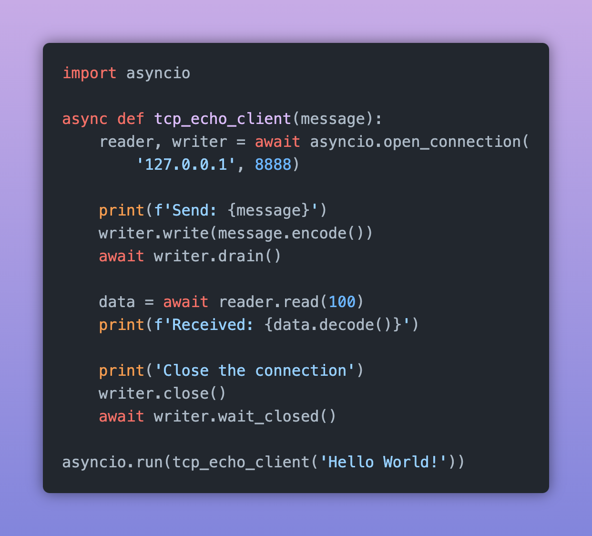
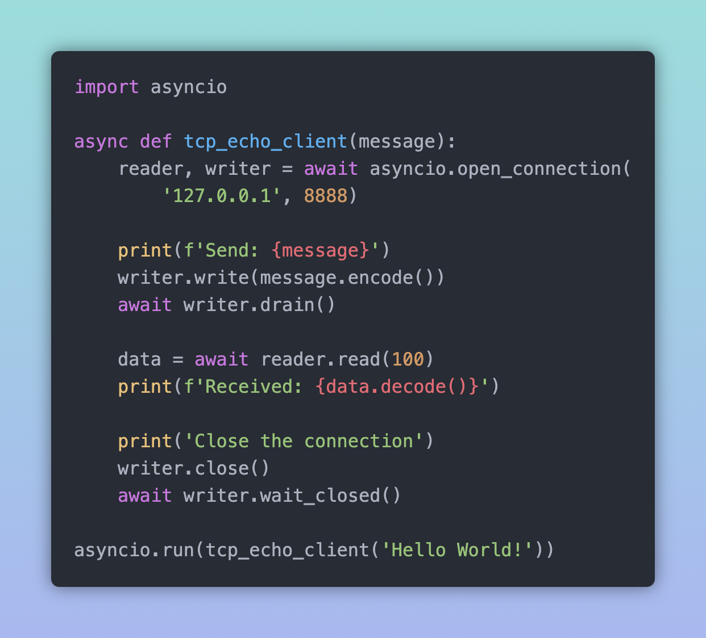
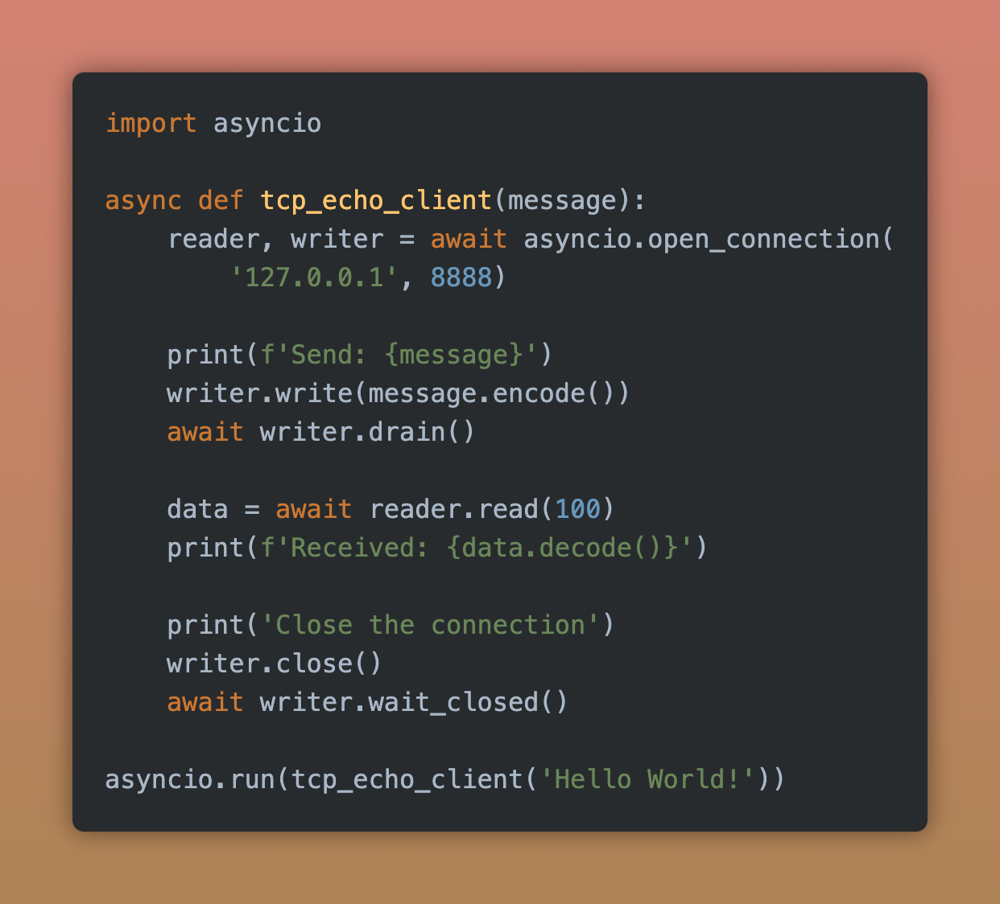
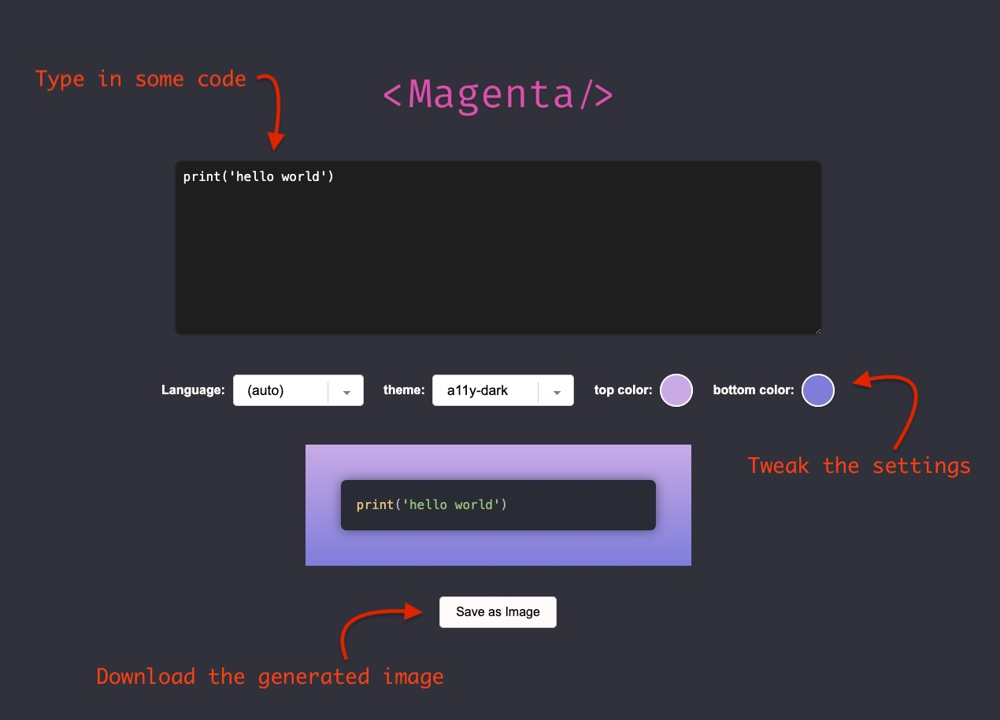

    

<h3 align="center">Create stunning code snippets to share on social media</h3>
 

  
  
  

<h3 align="center">How do you use Magenta?</h3>

1. Clone the project to your computer
2. Open the `index.html` file in a browser (ideally Google Chrome)
3. Type in some code and save the image!

 

    

